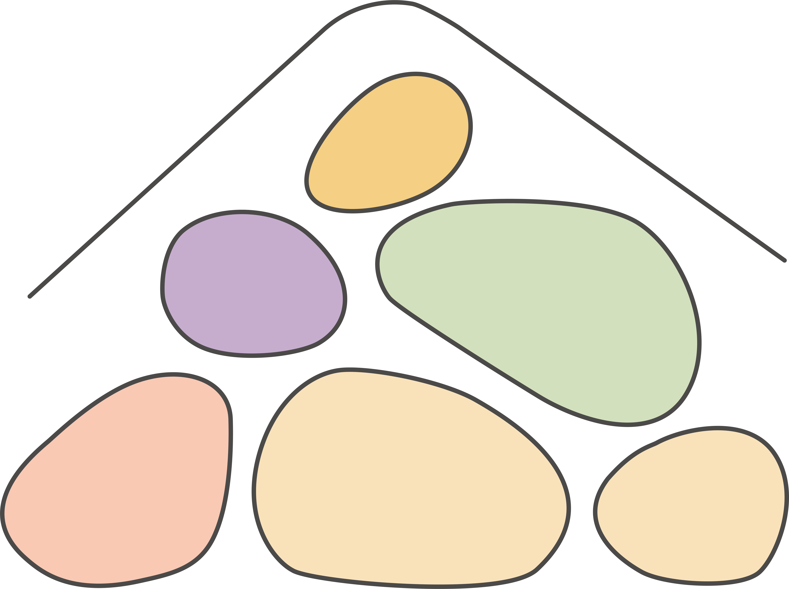

  

<h1 align="center">Les Cailloux – Case Study</h1>

UX/UI • Branding • Graphic Design • Web Design • HTML • CSS • Bootstrap • JavaScript

> **Projet complet de conception, UX/UI et développement Front-End**
> Réalisé dans le cadre de la formation **FIJ**.

---

## 📌 État du projet

🚧 Projet actuellement en cours de développement.

Les différentes étapes seront ajoutées progressivement au dépôt afin de refléter l'évolution du projet.

---

## 📖 Présentation du projet

Ce projet porte sur la refonte du site web de l'association **Les Cailloux**, une ASBL belge active dans l'accueil, l'accompagnement et l'éducation de mineurs.

Fondée en 1948, l'association **Domaine des Enfants Les Cailloux** a d'abord accueilli des orphelins de guerre avant d'élargir sa mission aux enfants confiés par les services d'aide sociale (CPAS) et les autorités compétentes.

Aujourd'hui, l'association offre un cadre de vie, un accompagnement éducatif, un soutien scolaire ainsi qu'un environnement favorisant le développement personnel des jeunes dans une approche humaniste, pluraliste et sans prosélytisme religieux ou politique.

Ce projet a pour objectif de proposer une version plus moderne, plus accessible et plus intuitive du site internet tout en respectant les valeurs et l'identité de l'association.

---

## 🎯 Objectifs du projet

* 🔎 Étudier le site existant
* 📊 Réaliser une analyse UX
* 💡 Identifier les axes d'amélioration
* 🎨 Concevoir une nouvelle identité visuelle
* 🖌 Créer un logo et un univers graphique cohérents
* 🌳 Repenser l'arborescence du site
* 📐 Concevoir des wireframes
* 🖥 Réaliser une maquette haute fidélité
* 💻 Développer le site en HTML5, CSS3, Bootstrap et JavaScript
* 📱 Garantir une expérience responsive
* ♿ Améliorer l'accessibilité

---

## 🎓 Contexte pédagogique

Ce projet est réalisé dans le cadre de la formation **FIJ**.

Il mobilise l'ensemble des compétences développées au cours de la formation :

* 🎨 Graphisme
* 🖌 Identité visuelle
* 💡 UX Research
* 🖥 UI Design
* 📐 Prototypage
* 💻 Développement Front-End
* 📱 Responsive Design
* 🌐 Gestion de projet web

L'objectif est de reproduire un véritable processus de conception et de développement d'un site internet, depuis l'analyse des besoins jusqu'à l'intégration finale.

---

## 🛠 Outils utilisés

### 🎨 Design graphique

* Adobe Illustrator
* Adobe Photoshop
* Adobe InDesign

### 🖥 UX / UI

* Penpot

### 💻 Développement

* HTML5
* CSS3
* Bootstrap 5
* JavaScript

### 🔧 Versioning

* Git
* GitHub

### 🤖 Intelligence artificielle

Certaines images de présentation (mockups sur des supports tels que des mugs, sacs ou autres objets promotionnels) ont été créées à l'aide d'outils d'intelligence artificielle.

Ces visuels sont basés sur le logo, les motifs graphiques et l'identité visuelle que j'ai entièrement conçus dans le cadre de ce projet.

L'IA a uniquement été utilisée pour illustrer les applications graphiques de cette identité visuelle.

---

## 📂 Contenu du projet

Ce dépôt rassemble l'ensemble des différentes étapes de conception :

* 📊 Analyse du site existant
* 📝 Recommandations UX
* 🎨 Moodboard
* 🎨 Brandboard
* ✨ Création du logo
* 🌳 Arborescence du site
* 📐 Wireframes
* 🖥 Maquette de la page d'accueil (Penpot)
* 💻 Développement Front-End

---

## 🎨 Démarche de conception

Le projet suit les principales étapes d'un véritable processus de création d'un site web :

1. Analyse du site existant
2. Étude des besoins
3. Recommandations UX
4. Création du moodboard
5. Création de l'identité visuelle
6. Élaboration du brandboard
7. Définition de l'arborescence
8. Conception des wireframes
9. Réalisation de la maquette dans Penpot
10. Développement Front-End
11. Optimisation responsive
12. Tests et améliorations

---

## 👩‍💻 À propos

Ce projet illustre ma capacité à mener un projet web dans sa globalité, en combinant analyse, conception graphique, UX/UI et développement Front-End.

Il reflète la méthodologie acquise au cours de ma formation ainsi que mon intérêt pour la création d'interfaces à la fois esthétiques, accessibles et centrées sur les utilisateurs.

---

## ⭐ Remerciements

Merci de votre visite !

N'hésitez pas à parcourir ce dépôt et à suivre son évolution au fil des mises à jour.